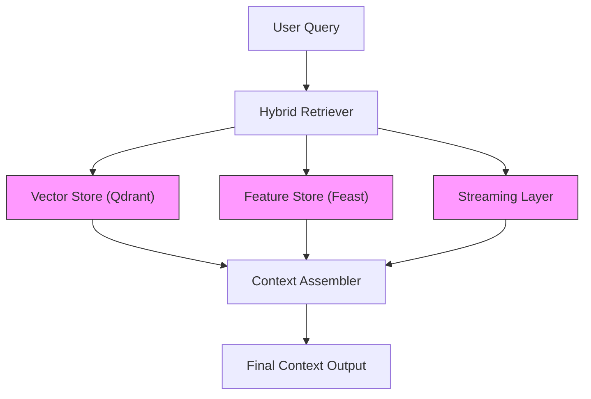

# ARCHITECTURE

## 👥 Contributors

- Nguyễn Văn Lĩnh
- Phạm Lê Hoàng Nam

---

## 1. 🎯 System Overview

Mục tiêu của hệ thống là xây dựng một **Hybrid Memory AI Assistant** cho người dùng Việt Nam, kết hợp:

- **Episodic memory (Vector Store)** — lưu trữ lịch sử tương tác và tài liệu
- **Stable user profile (Feature Store)** — lưu đặc điểm dài hạn của user
- **Recent activity (Streaming features)** — phản ánh hành vi gần đây

Hệ thống sử dụng mô hình:

> **retrieve → enrich → assemble context**

---

## 2. 🏗️ High-level Architecture



---

## 🔄 Data Flow

1. User gửi query
2. Hybrid Retriever:
    - Search **episodic memory** từ Vector DB
    - Lấy **user profile** từ Feature Store (point-in-time correct)
    - Lấy **recent activity** từ streaming layer
3. Context Assembler:
    - Kết hợp tất cả signals thành context có cấu trúc
4. (Optional) Gửi vào LLM để generate response

---

## 3. ⚖️ Key Architectural Decisions & Tradeoffs

---

### 3.1 📦 Chunking Strategy (Episodic Memory)

#### Options considered

| Strategy          | Ưu điểm         | Nhược điểm    |
| ----------------- | --------------- | ------------- |
| Per-message       | Đơn giản        | Mất ngữ cảnh  |
| Per-conversation  | Giữ context tốt | Chunk quá lớn |
| Semantic chunking | Cân bằng        | Phức tạp hơn  |

---

#### ✅ Decision

→ **Semantic chunking (~200–400 tokens, overlap 20%)**

- Chunk theo **semantic boundary**
- Dùng sliding window để giữ continuity

---

#### ⚖️ Tradeoffs

**Pros:**

- ✅ Retrieval quality cao hơn
- ✅ Giữ ngữ cảnh tốt

**Cons:**

- ❌ Tốn compute khi ingest
- ❌ Storage tăng (~1.2–1.5x)

---

#### ❌ Why not per-conversation?

- Chunk quá lớn → vượt context window
- Retrieval noise cao → khó rank

---

### 3.2 👤 Feature Schema Design (User Profile)

#### ✅ Decision

→ **Tabular features (Feast) + derived signals**

```yaml
user_id:
    - preferred_language (vi / en / mix)
    - topic_affinity (AI, cloud, pháp luật...)
    - reading_speed_wpm
    - active_hours
    - expertise_level
```

---

#### ❌ Alternative rejected: Embedding profile

- Encode toàn bộ user thành 1 embedding

**Problems:**

- Khó interpret
- Không kiểm soát được features
- Không phù hợp rule-based logic

---

#### ⚖️ Tradeoffs

| Approach  | Pros               | Cons                  |
| --------- | ------------------ | --------------------- |
| Tabular   | Dễ debug, explain  | Không capture sâu     |
| Embedding | Capture nuance tốt | Khó kiểm soát, update |

---

#### 🎯 Final choice

→ **Tabular + lightweight aggregation (topic_affinity)**

---

### 3.3 ⏱️ Freshness Strategy

#### ❓ Câu hỏi

User vừa đọc xong → khi nào AI “nhớ”?

---

#### ✅ Decision: Hybrid (3-tier)

| Use case       | Freshness   | Mechanism           |
| -------------- | ----------- | ------------------- |
| Chat memory    | ~sub-second | Streaming ingestion |
| Topic trend    | ~5 phút     | Micro-batch         |
| Profile update | ~daily      | Batch job           |

---

#### ⚖️ Tradeoffs

| Strategy | Pros     | Cons            |
| -------- | -------- | --------------- |
| Realtime | UX tốt   | System phức tạp |
| Batch    | Đơn giản | Data stale      |

---

#### ❌ Why not full realtime?

→ Cost cao + noise  
(user query ngẫu nhiên không nên update profile ngay)

---

## 4. 🚫 Design Rejection

### ❌ Không lưu episodic memory trong Feature Store

#### Reason:

**Feature Store:**

- Structured data
- Point-in-time joins

**Episodic memory:**

- Unstructured
- Cần vector search

---

#### ⚠️ Nếu gộp chung:

- Giảm performance
- Tăng complexity

---

#### ✅ Final decision:

- Vector DB → episodic
- Feature Store → profile

---

## 5. 🇻🇳 Vietnamese Context Considerations

---

### 5.1 Code-switching

Ví dụ:

- “deploy Kubernetes cluster như nào”
- “scale hệ thống backend”

👉 Giải pháp:

- Normalize text
- Multilingual embedding

---

### 5.2 Phonetic typos

Ví dụ:

- kubernet
- cubernet
- k8s

👉 Xử lý:

- Synonym expansion
- Fuzzy matching

---

### 5.3 Tokenization

#### Options:

- Whitespace
- Pyvi / Underthesea

#### ✅ Decision:

→ Dùng **multilingual embedding + raw text**

**Reason:**

- Tokenizer VN không ổn định
- Embedding xử lý semantic tốt hơn

---

### 5.4 Privacy (Decree 13)

Yêu cầu:

- Consent
- Right to delete

👉 Hệ thống cần:

- Filter theo user_id
- Support delete

---

## 6. ⚠️ Limitations

POC chưa xử lý:

- ❌ Multi-user isolation mạnh
- ❌ Memory deletion
- ❌ Memory decay (TTL)
- ❌ Cross-device sync
- ❌ Re-ranking nâng cao
- ❌ LLM integration thật

---

## 7. 🚀 Future Improvements

- Memory consolidation (weekly summary)
- Personalization re-ranking
- TTL-based decay
- Hybrid retrieval (BM25 + vector)

---

## 8. 💡 Key Insight

> Thiết kế memory cho AI không phải chỉ là lưu dữ liệu

Mà là:

- Quyết định **cái gì nên nhớ**
- **Nhớ bao lâu**
- Và **dùng khi nào**

---

## 🧠 Vibe Coding Reflection

**Good prompt:**

> Design tradeoffs between vector DB and feature store

**Bad prompt:**

> Write full architecture

---

## ✅ Tổng kết

Hệ thống đạt được:

- Hybrid memory (vector + feature + streaming)
- Tradeoff rõ ràng
- Context-aware cho user Việt
- POC đơn giản nhưng scalable
